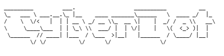

# CyberSecurity Awareness Chatbot - CyberBot

## Project Description
The CyberSecurity ChatBot is a C# console application designed to educate users about cybersecurity awareness. It provides interactive respones on topics such as phishing, malware, password safety, etc.

## Features
- Personalised user interaction by using the user name
- Voice greeting using a WAV file
- ASCII art logo display
- Structured and colourful console UI
- Typing effect for a realistic conversation
- Menu system + text input
- Cybersecurity awareness topics

## Technologies used
- C# (.NET Console Application)
- System.Media
- Github

## How to Run the Project
1. Open the terminal in the project folder
2. Run the following command: "dotnet run."
    
## ASCII art image

